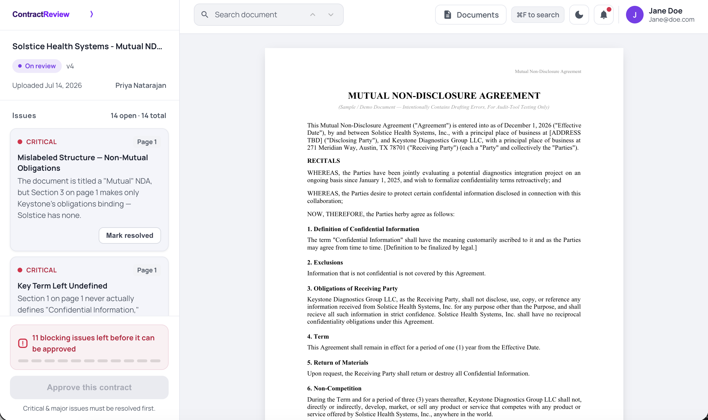
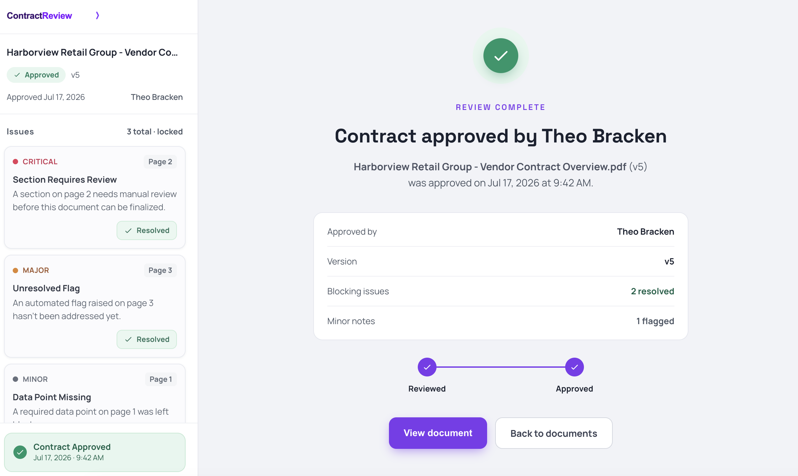
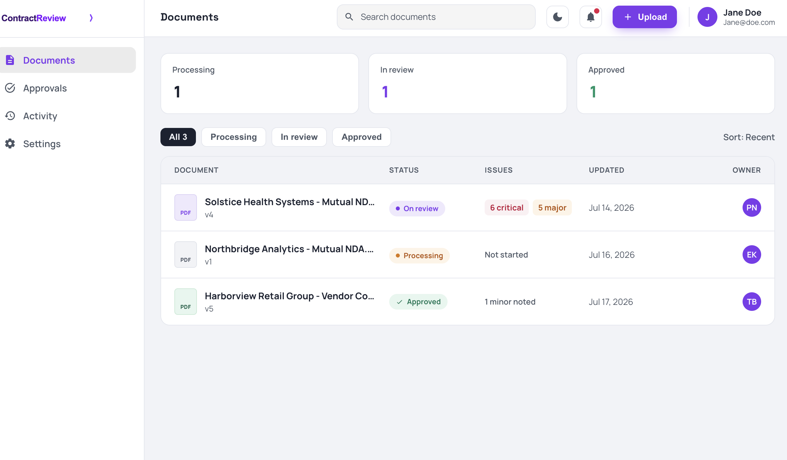
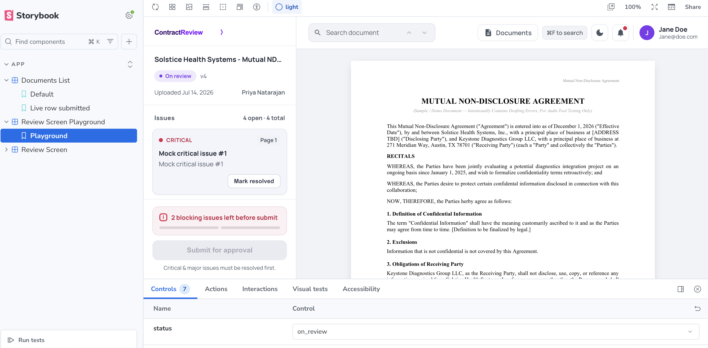

# Demo Contract Review App Frontend

A demo frontend for a contract review tool: users land on a Documents list, open a contract into a review workflow (view the PDF, search it, resolve issues), and approve it once all blocking issues are cleared.

### Review page 
 

### Approved


### Documents list


There is no backend yet — this frontend may become part of a bigger contract review product down the line. Document/issue data is loaded via an HTTP call against a static JSON file standing in for a `GET /api/documents` response — a genuine loading state, not data baked into the bundle. The current user and theme are still simple hardcoded state (no fetch, no API to stand in for yet).

## What's left for production
This is a working prototype, not a production app — everything is mocked, and there's no real backend behind it yet. To actually ship this, we'd still need:

- **Accounts & permissions** — real login instead of a fake logged-in user, and rules for who's allowed to view or approve each document.
- **Testing** — Storybook stories are run as browser tests (`test-storybook`), but there's no real unit-test suite for the app logic itself yet (see "Deployment" below re: CI checks).
- **Performance** — the app loads more code up front than it needs to, and hasn't been tried yet with large real documents or long document lists.
- **Monitoring** — a way to know when something breaks in production, plus basic usage tracking.
- **Security** — validating anything users upload or search for, and safely handling any API keys.
- **Deployment** — no CI/CD yet: no automated build/release pipeline, and no checks (type-check, lint) enforced on push before code lands.
- **Error boundaries** — the initial document load now shows a clear message if the mock "API" fetch fails, but there's still no top-level React error boundary catching unexpected render crashes elsewhere in the app.

## Getting started

Requires Node.js and npm.

```bash
npm install
npm run dev
```

This starts the Vite dev server (prints the local URL, typically `http://localhost:5173`).

## Available scripts

| Command | Description |
| --- | --- |
| `npm run dev` | Start the Vite dev server |
| `npm run build` | Type-check (`tsc -b`) then produce a production build (`vite build`) |
| `npm run lint` | Run oxlint |
| `npm run preview` | Preview the production build locally |
| `npm run storybook` | Start Storybook on port 6006 |
| `npm run build-storybook` | Build the static Storybook site |
| `npm run test-storybook` | Run every story as a Playwright-backed browser test |

There is no separate app test suite — verification for any change is `npx tsc -b` and `npx oxlint`, both of which should produce no output.

## Storybook



Storybook mocks the whole app (not just individual components) by seeding the same Zustand stores the app reads from, then rendering `<App />` inside a `MemoryRouter`. This lets you preview different states — no issues, all-blocking-resolved, approved, dark mode, different documents/statuses, etc. — without a backend.

```bash
npm run storybook
```

Open `http://localhost:6006` and browse the `App/*` story groups. There's also an interactive `App/Review Screen Playground` story with Storybook controls for tweaking issue counts, status, and theme live.

## Notes & decisions

### Stack choices

- **Why not Next.js** — not needed; this is a simple frontend, so an SSR framework isn't justified.
- **Why Zustand** — simple state management needs; no justification for the extra ceremony of Redux or Context.
- **Why MUI, not Tailwind** — for a document/form/internal-tool-style application, MUI provides a more consistent set of mature, stable components out of the box.

## Project structure

```
src/
├── App.tsx                     # Routes; also fetches useDocumentStore's data on
│                                #   mount and gates the routes behind a loading spinner
├── ReviewScreen.tsx             # Review/approved screen shell (drawer + PDF viewer)
├── main.tsx                     # Entry point, wraps <App/> in BrowserRouter
├── routes.ts                    # documentPath(id), useDocumentId()
├── theme.ts                     # MUI theme factory + "Slate" design tokens
│
├── components/
│   ├── documents/
│   │   ├── DocumentsPage.tsx     # Documents list landing page ("/")
│   │   ├── DocumentInfo.tsx      # Sidebar document metadata (name, status, version)
│   │   ├── IssuesList.tsx        # Sidebar issue cards, resolve toggle
│   │   ├── StatusPill.tsx        # Shared review-status pill (list + sidebar)
│   │   ├── ApprovedPage.tsx      # Post-approval confirmation screen
│   │   ├── PdfViewerPage.tsx     # react-pdf rendering, issue → page jump
│   │   ├── PdfSearchBar.tsx      # Cmd/Ctrl+F search bar UI
│   │   ├── usePdfSearch.ts       # Shared search state/match-counting logic
│   │   └── pdfSearch.css         # Search-highlight + page-jump-pulse styles
│   │
│   └── layout/
│       ├── AppNavbar.tsx         # Review screen top bar
│       ├── SideMenu.tsx          # Review screen left drawer (issues, approve gate)
│       ├── UserChip.tsx          # Shared header avatar/name (both screens)
│       └── WIPDialog.tsx         # Generic "not implemented" modal
│
├── store/                        # Zustand — all app data lives here, no backend
│   ├── useDocumentStore.ts       # reviews, fetch status, toggleResolved(), approve()
│   ├── documentRows.ts           # Pure derivation of the documents-table rows
│   ├── useUserStore.ts           # Current logged-in user (hardcoded)
│   ├── useThemeStore.ts          # Light/dark mode
│   ├── useViewerStore.ts         # Issue → PDF page-jump pub/sub
│   └── useWIPDialogStore.ts      # WIPDialog open/close state
│
└── types/
    └── review.ts                 # Review/Issue/ReviewUser/ReviewDocument shapes

public/
├── contracts/                    # Sample contract PDFs the mock documents point at
│   ├── Flawed_NDA_Demo.pdf
│   ├── Mutual_NDA_Demo.pdf
│   └── Vendor_Contract_Overview.pdf
├── mock_data/
│   └── documents_api_mock.json   # Fetched mock "GET /api/documents" response
└── logo.svg, favicon.svg, avatar.svg

.storybook/                       # Storybook config (theme decorator, a11y addon)
```